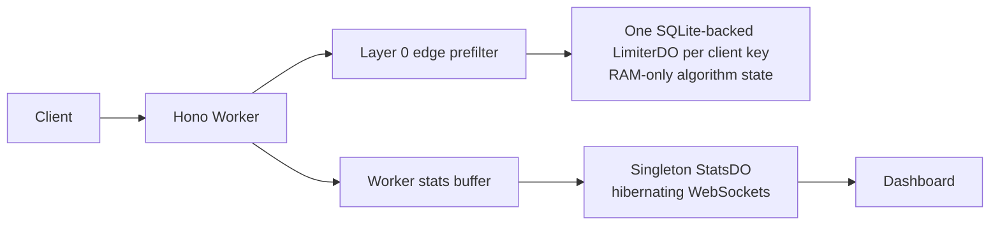

# guard

A Cloudflare Workers rate-limiter lab showing Token Bucket, Sliding Window Counter, and Sliding Window Log decisions through one public request path.

## Run locally

```sh
bun install
bun run dev
bun run test
bun run bench
```

Open the dashboard with `bun --cwd dashboard dev` and point `VITE_GUARD_API` at the Worker URL.

## Architecture



## Trade-offs

- Limiter state is RAM-only by design. Durable Object eviction can temporarily over-admit an idle key; the idle-gap script records observed behavior.
- The Rate Limiting binding is a coarse, per-location edge guard, not the correctness decision.
- Stats are approximate because events flush in batches and isolates do not share buffers.
- A singleton stats object is acceptable for this portfolio demo but would need sharding at higher traffic.

## Results

All figures below remain `TBD` until measured output is committed under `bench/results/`.

| Metric | Result |
| --- | --- |
| decision p50 / p95 | TBD (run `bun run bench`) |
| do_rtt p50 / p95 | TBD (run `bun run bench`) |
| e2e p50 / p95 | TBD (run `bun run bench`) |
| idle gap survival | TBD (run `bun run bench`) |
| shadow accuracy by preset | TBD (run `bun run bench`) |

## Cloudflare notes

The Worker configuration declares both Durable Objects as SQLite-backed. No storage API is used on the request path. Verify the installed Wrangler Rate Limiting binding TOML syntax and current WebSocket hibernation signatures before deployment.
