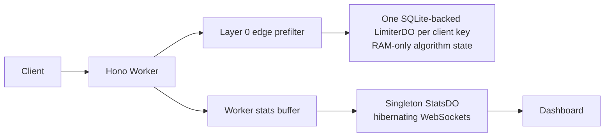

# guard

A Cloudflare Workers rate-limiter lab showing Token Bucket, Sliding Window Counter, and Sliding Window Log decisions through one public request path.

## Run locally

```sh
bun install
bun run dev
bun run test
bun run bench
```

Open the dashboard with `bun --cwd dashboard dev` and point `VITE_GUARD_API` at the Worker URL.

## Cloudflare build settings

For a **Worker deployment**, set the deploy command to:

```sh
bun run deploy
```

This runs Wrangler from `worker/`, where `worker/wrangler.toml` and its dependency are defined. Do not use `npx wrangler deploy` from the repository root.

For the current **unified Workers deployment**, build the dashboard as Worker static assets:

```text
Build command: bun run deploy
Worker configuration: worker/wrangler.toml
Static assets: dashboard/dist
```

The root `deploy` script builds `dashboard/` and then deploys the Worker plus its assets. The dashboard uses same-origin `/api/*` requests in production, so no `VITE_GUARD_API` variable is required for the unified deployment.

The Worker URL now serves both the dashboard and API. `/` serves the built dashboard, while `/api/*`, `/v1/*`, and `/health` remain Worker routes.

### Custom domain example

With the unified Workers model, use one hostname:

```text
guards.hutamalabs.dev       -> Worker plus dashboard static assets
```

In Cloudflare:

1. Configure `guards.hutamalabs.dev` as the Worker custom domain.
2. Set the build/deploy command to `bun run deploy`.
3. Deploy from the repository root so `dashboard/dist` is built before Wrangler uploads assets.

After DNS propagation, open `https://guards.hutamalabs.dev`. The same origin serves the dashboard and its API.

## Architecture



## Trade-offs

- Limiter state is RAM-only by design. Durable Object eviction can temporarily over-admit an idle key; the idle-gap script records observed behavior.
- The Rate Limiting binding is a coarse, per-location edge guard, not the correctness decision.
- Stats are approximate because events flush in batches and isolates do not share buffers.
- A singleton stats object is acceptable for this portfolio demo but would need sharding at higher traffic.

## Results

All figures below remain `TBD` until measured output is committed under `bench/results/`.

| Metric | Result |
| --- | --- |
| decision p50 / p95 | TBD (run `bun run bench`) |
| do_rtt p50 / p95 | TBD (run `bun run bench`) |
| e2e p50 / p95 | TBD (run `bun run bench`) |
| idle gap survival | TBD (run `bun run bench`) |
| shadow accuracy by preset | TBD (run `bun run bench`) |

## Cloudflare notes

The Worker configuration declares both Durable Objects as SQLite-backed. No storage API is used on the request path. Verify the installed Wrangler Rate Limiting binding TOML syntax and current WebSocket hibernation signatures before deployment.
